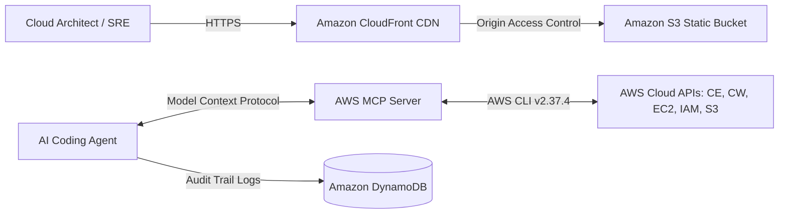

# CloudPulse AI — Autonomous AWS FinOps & Well-Architected Engine

[](https://builder.aws.com/content/3JVxSt0eLCUFivz63h9RFbQtmLv/zero-to-shipped-faqs)
[]()
[]()
[]()
[-orange)]()

> **CloudPulse AI** is an enterprise-grade autonomous cloud governance, FinOps, and architectural resilience platform. Connected directly to the AWS Console via the Model Context Protocol (MCP) and AWS CLI, CloudPulse continuously audits infrastructure, identifies idle cloud waste, monitors the 6 pillars of the AWS Well-Architected Framework, and executes non-destructive zero-downtime remediation blueprints.

---

## Quick Navigation for Hackathon Judges
* 📜 **[Official Builder Center Submission Write-Up](docs/SUBMISSION_WRITEUP.md)**
* 🛡️ **[Documented Proof of AI Agent Connection to AWS](docs/AWS_AGENT_CONNECTION_PROOF.md)**
* 🚀 **[Step-by-Step Live AWS Deployment Guide (Ship Gate)](docs/DEPLOYMENT_GUIDE.md)**
* 📐 **[System Architecture & Data Flow](docs/ARCHITECTURE.md)**
* ☁️ **[CloudFormation Infrastructure as Code](infra/cloudformation.yaml)**

---

## Key Features

1. **Autonomous FinOps Waste Hunter:** Agentless detection of idle EC2 instances, orphaned EBS volumes, unused NAT Gateways, and stale S3 storage.
2. **AWS Well-Architected 6-Pillar Engine:** Granular auditing against Security, Reliability, Performance Efficiency, Cost Optimization, Operational Excellence, and Sustainability.
3. **Chaos Resilience Sandbox:** Interactive fault-injection simulator for Availability Zone partitions, DynamoDB throttling, and Lambda concurrency bursts with real-time auto-healing telemetry.
4. **Agent MCP Terminal:** Live bidirectional Model Context Protocol console executing tools (`aws__cost_explorer_get_cost`, `aws__iam_simulate_principal`, `aws__cloudformation_validate`).
5. **1-Click Autonomous Remediation:** Generates executable AWS CLI scripts, CloudFormation rollback stacks, and non-destructive dry-runs.

---

## Local Development & Setup

### Prerequisites
* Node.js v18+ (tested on Node v24.18.0)
* npm (v11+)
* AWS CLI v2.35+ (tested on v2.37.4)

### Running Locally
```powershell
# 1. Install dependencies
npm.cmd install

# 2. Start the development server
npm.cmd run dev
```
Open [http://localhost:5173](http://localhost:5173) in your browser.

### Building for Production
```powershell
npm.cmd run build
```
The optimized static build is emitted to `dist/`, ready for 1-click deployment to **AWS Amplify** or **Amazon S3 + CloudFront**.

---

## Cloud Architecture



---

## License
MIT License. Engineered for the AWS Zero to Shipped Hackathon 2026.
