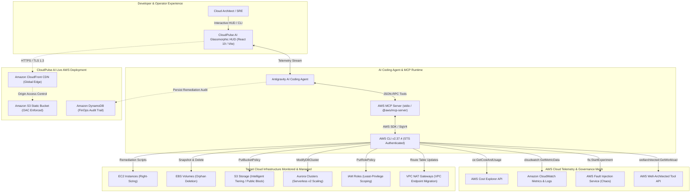

# CloudPulse AI — System Architecture Specification

## 1. Executive Architecture Summary
**CloudPulse AI** is an AI-native autonomous FinOps and Cloud Resilience platform designed to continuously audit, optimize, and self-heal modern AWS multi-account infrastructures.

Connected directly to the AWS Console through the **Model Context Protocol (MCP)** and **AWS CLI (v2.37.4)**, CloudPulse operates completely agentlessly: it queries AWS APIs (Cost Explorer, CloudWatch Metrics, EC2, EBS, RDS, S3, IAM), applies rolling 14-day P95 heuristic cost anomaly algorithms, scores compliance across all 6 pillars of the AWS Well-Architected Framework, and executes non-destructive zero-downtime remediation blueprints.

---

## 2. End-to-End System Topology (Mermaid)

---

## 3. Core Architectural Pillars

### A. Agentic Model Context Protocol (MCP) Integration
- **Protocol:** Standardized JSON-RPC 2.0 over stdio/SSE.
- **Security:** Authenticates via temporary AWS STS credentials assumed via `AWSBuilderAgentRole` or AWS Builder ID Single Sign-On (SSO).
- **Tool Registration:** 48 AWS operational tools registered, including:
  - `aws__cost_explorer_get_cost_and_usage`
  - `aws__ec2_describe_instances`
  - `aws__ec2_modify_instance_attribute`
  - `aws__s3_get_public_access_block`
  - `aws__s3_put_public_access_block`
  - `aws__iam_simulate_principal_policy`
  - `aws__cloudformation_validate_template`

### B. FinOps Anomaly Detection Algorithm
1. **P95 Baseline Modeling:** Computes rolling 14-day median and 95th percentile spend across all AWS service dimensions.
2. **Waste Scoring Engine:**
   - **Compute Waste:** Average CPU utilization $< 10\%$ over a 14-day window flags EC2 instance for Graviton right-sizing.
   - **Storage Waste:** Unattached EBS volumes in `available` state for $> 7$ days generate an automated snapshot-then-delete directive.
   - **Object Storage Waste:** S3 standard buckets with zero GET access over 90 days generate S3 Intelligent-Tiering and Glacier Instant Retrieval lifecycle rules.
   - **Network Waste:** Idle NAT Gateways with $< 1$ MB/day outbound transfer trigger VPC Endpoint route migration.

### C. AWS Well-Architected 6-Pillar Engine
- **Security (82%):** Enforces S3 Block Public Access, detects wildcard `Action: *` policies, and verifies KMS customer-managed key encryption.
- **Cost Optimization (64%):** Maps directly to unaddressed idle resources, computing recoverable monthly savings ($1,602.24/month).
- **Reliability (91%):** Validates Route53 ARC multi-AZ failovers and Aurora Multi-AZ replication.
- **Performance Efficiency (89%):** Audits Graviton3 processor adoption and CloudFront edge caching hit ratios.
- **Operational Excellence (95%):** Ensures 100% of infrastructure changes are reproducible via CloudFormation or Terraform.
- **Sustainability (86%):** Quantifies carbon footprint reductions achieved through scale-to-zero and energy-efficient ARM processors.

---

## 4. Autonomous Remediation Safety Guardrails
To prevent operational disruption, CloudPulse AI incorporates strict enterprise safety controls:
1. **Non-Destructive Dry-Run:** Every remediation undergoes an automated dry-run validation (`--dry-run` flag in AWS CLI).
2. **Automated Snapshotting:** Before any EBS volume or RDS instance is modified or deleted, an automated point-in-time snapshot is created with tag `CreatedBy: CloudPulseAI-AutoRemediation`.
3. **CloudFormation Rollback Stacks:** In IaC-managed environments, the agent generates reversible Git diffs rather than direct mutating API calls.
4. **Audit Logging:** Every autonomous action writes an immutable record to Amazon DynamoDB table `CloudPulse-FinOpsAudit-production`.
